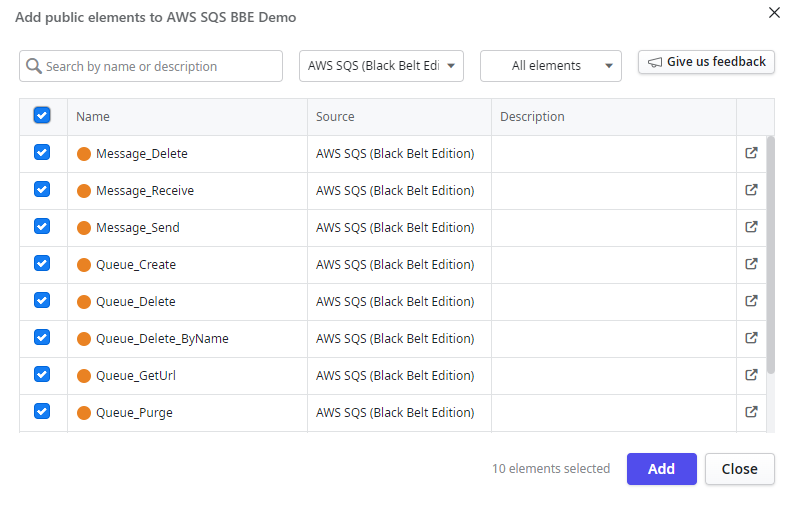
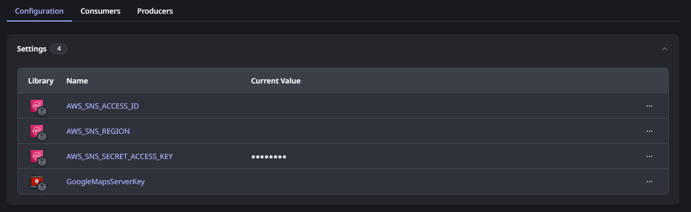
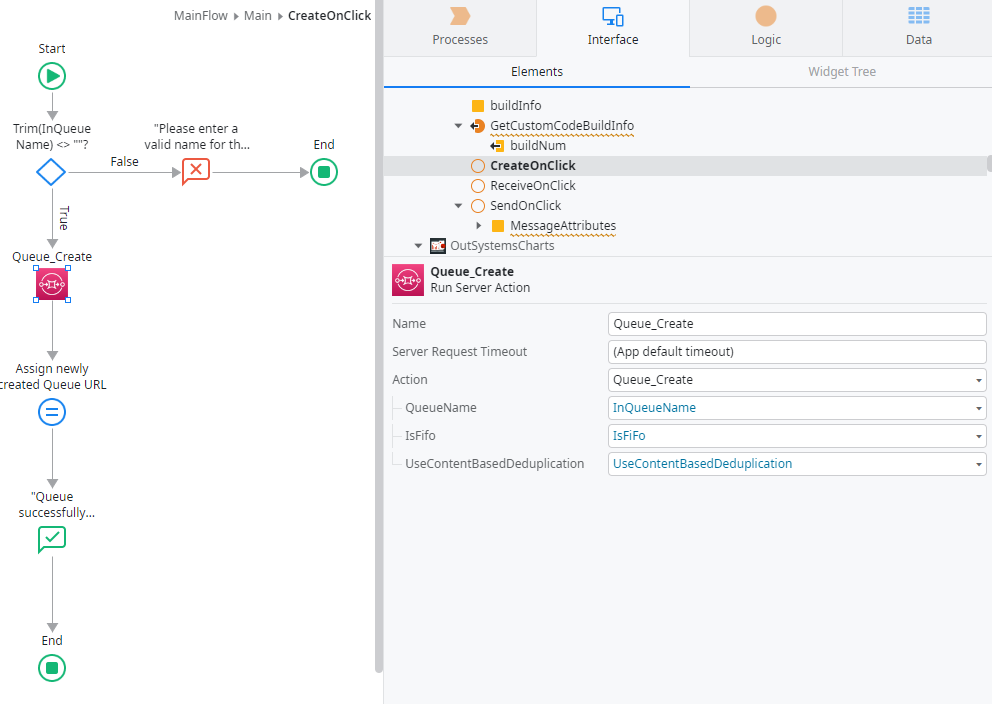
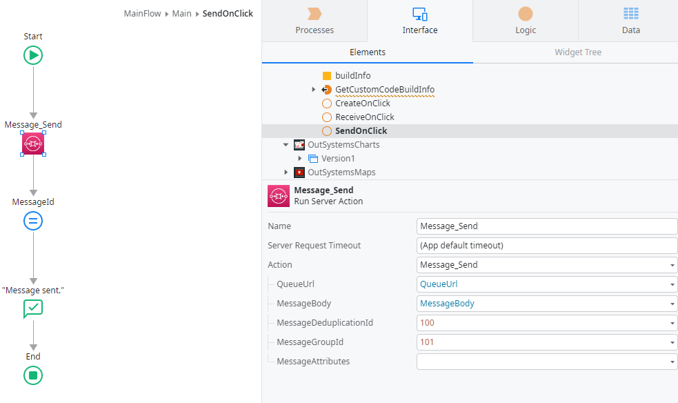
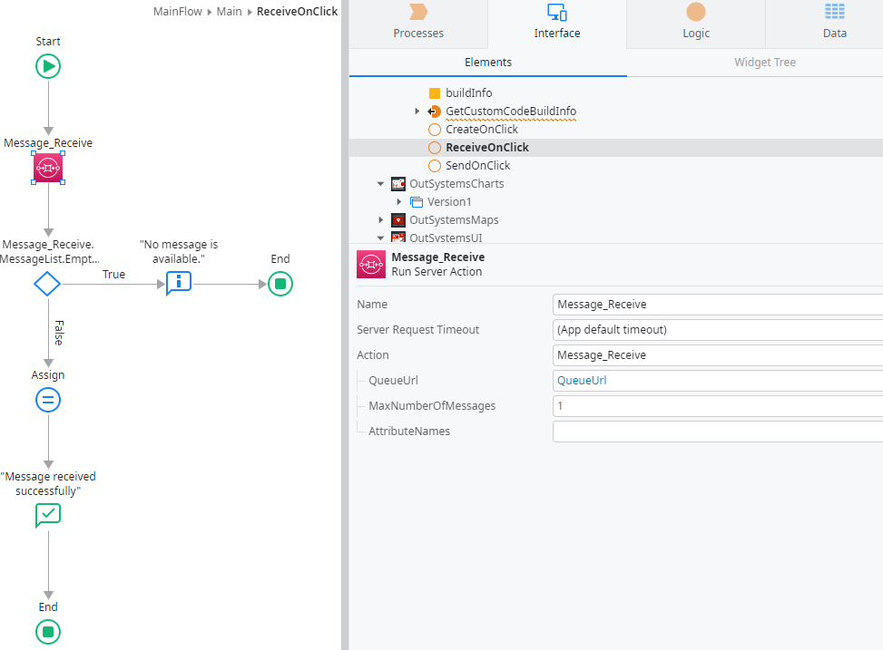

# Sample for ODC

## Introduction

OutSystems Developer Cloud (ODC) is a cloud-native app development platform that provides a modular, scalable environment in which you develop and deploy your apps. With ODC you can build and deploy enterprise-grade, mission-critical apps in weeks. You can build web apps, web portals, mobile apps, and business workflows faster than with traditional development tools. You can then deploy your apps in a scalable, secure, and high-performance environment.

This connector has two parts:

1. A custom code extension : AWS_SQS_ExternalLogic
2. A library that uses the underlying custom code extension: AWS SQS (Black Belt Edition)

The connector provides the following functionality (as of now):

1. Message_Delete
2. Message_Receive
3. Message_Send
4. Queue_Create
5. Queue_Delete
6. Queue_Delete_ByName
7. Queue_GetUrl
8. Queue_Purge

There is also a operational support API to discover the unique build number for this connector so that any bugs discovered can be reported against this unique build number. The API is

1. GetBuildInfo

## Pre-requisites

To use this component correctly, you should have:

1. A valid set of AWS credentials (as access keys) with permissions to perform the SQS relevant functions

(For testing purposes, you may AmazonSQSFullAccess, however, you should always limit the permissions to the bare minimum for production use)

## Installation

You can install the connector through [ODC Forge](https://success.outsystems.com/documentation/outsystems_developer_cloud/forge/install_or_update_a_forge_asset/#install-a-forge-asset).

You should install both the custom code extension as well as the AWS SQS (Black Belt Edition) library.

## How to Use

### Add library to your application

Firstly, add the _AWS SQS (Black Belt Edition)_ library to your application as shown below.

Depending whether you want to use all the APIs, you can selectively add the needed APIs (or removed unused ones automatically later).

### Configuration

The _AWS SQS (Black Belt Edition)_ library requires a few settings to be configured in ODC portal for your application which is using the library:

| S/No. | Name of setting           | Remarks                        |
| ----- | ------------------------- | ------------------------------ |
| 1.    | AWS_SQS_ACCESS_ID         | The IAM user access key ID     |
| 2.    | AWS_SQS_REGION            | The SQS region of choice       |
| 3.    | AWS_SQS_SECRET_ACCESS_KEY | The IAM user access key secret |

### Example 1: Create a queue

To create a queue, you will need to supply the right configuration values. The screenshot below gives an example.

NOTE: For the queue type, you should use the supplied Entities.QueueType.

### Example 2: Send a message

To send a message, you will need to supply _queueURL_. This is obtained when you create the queue. MessageGroupId and MessageDeduplicationId are mandatory. They are internally controlled by your application. For more information on the use of these arguments, please consult AWS SQS documentation.

### Example 3: Receive a message

To receive a message, you will also need the _queueURL_ which is obtained when the queue is created. You can also indicate the maximum messages to retrieve.

## Limitation

1. Only text messages are allowed. If you need to send binary data, you might want to encode it as base64 before sending
2. The maximum payload sent/receive is 5.5 MB

## Found a bug?

Kindly submit your bug report [here](https://github.com/PaulHoOutsystems/amazon-sqs/issues) and do indicate the build number of the library which you are using too.

## Contact

You can reach out to me via email at paul.ho@outsystems.com
